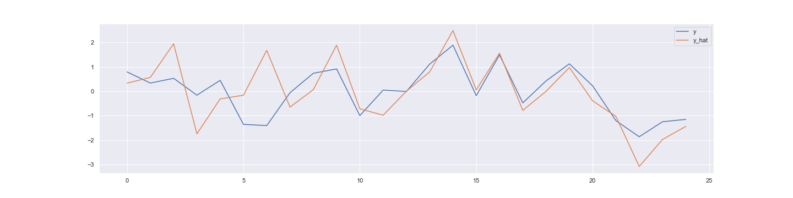
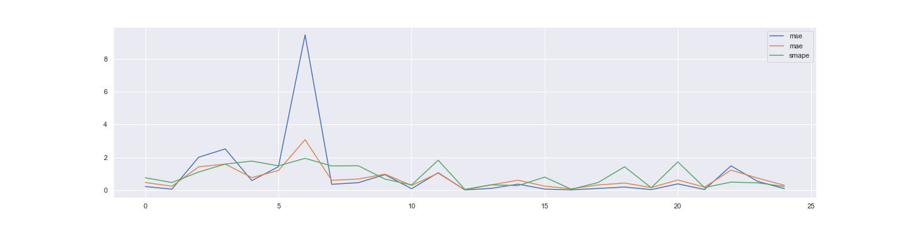
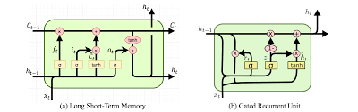
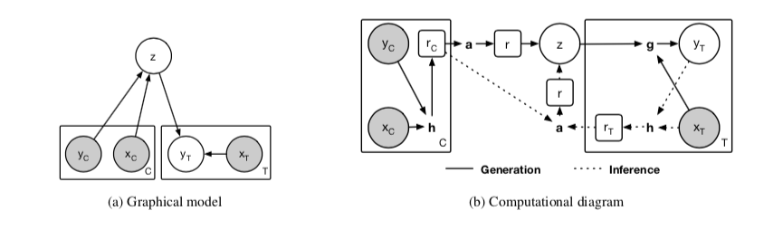

## Neural Time Series Analysis

---
## Intro
- Time-series
- Models
- Attention mechanism
- Visualization

---
## Definition
A time-series is defined as an ordered sequence of observation evenly spaced in time of a generating process. 


Let `y` be the target series, `t` the time index and `f` the generating process.

`y_t = f(y,t)`

Note:
y is also called the endogenous variables in the economic setting


For multivariate setting instead we can consider some driving series `x` that influences the target series `y`: 

`y_t = f(y, x, t)`

Note:
This particular setting rely on the assumption that the target series contains all the necessary information, at any point in time, of the generating process.
If the target process is the result of a complex dynamical system like the stock market, or the internet, this assumption doesn't hold.

---
### Learning
Let's consider a simple regression problem, where we want to predict the next k values of the target series `y`, by approximating `f` via the minimization of some loss function `loss`.


```python
y_hat = f_hat(x,y,t)
loss = np.mean(loss(y,y_hat))
```


Different loss functions enable the learning of specific features of the target series, for example:

```python
mse = np.square(l-l_hat)
mae = np.abs(l-l_hat)
smape =  2*np.abs(l-l_hat) / (np.abs(l) + np.abs(l_hat))
```





Note:
plot me
Learning problem
symmetric mean absolute percentage error is not differentiable, so we have to smooth it in 0.


[Notebook](https://github.com/d3sm0/ntsa/blob/master/nb/preprocess.ipynb)

---
## Models

- Forward
- Sequence to Sequence (encoder-decoder)

Note:
In order to approximate f, we can use two classes of models


### Forward
Forward models are models that maps:

` x,t,y -> y_hat `

Examples are linear, convolutional and recurrent neural networks.


#### Recurrent Neural Networks



Note:
If we have vector of different size,
or we may want k estimates out of t times,
we have to use a differ way to remap the time dependency.
One way of doing it is to use an encoder-decoder architecture


### Encoder-Decoder

In this class of models we have an encoder and a decoder. 

`encoder(y,x,t) -> z`

`decoder(z) -> y_hat`


- sequence_legnth != prediction_len
- y_features for all k predictions, like day of the estimate
- z is latent representation of the input that we can manipulate


Notice:
- We are not taking into account any uncertainty associated with the prediction
- All those models are deterministic by construction

Note:
A draw back of this class of models is that they are deterministic in nature and they don't offer any estimates about the uncertainty associate with the conditional mean
There is a whole class of models call GPs that can fix this, but we won't go into detail, and stick to fully differentiable models


#### Neural Process
A neural process is a new class of latent variables models, that learns a distribution over functions, condition of the latent random variable.




At training time we randomly split the batch in context and target points we minimize the conditional ELBO:

```
elbo = - d.log_likelihood(y_target) + kl(q|p)
```

where:
- q is the distribution over the context point
- p is the distribution over the overall dataset
- d is the distribuion of the target_points given the z sampled from q


At inference time, we can sample from the posterior distribution, givent the target points and the a sample from q


[RNN regression](https://github.com/d3sm0/ntsa/blob/master/nb/crypto_regression.ipynb)

[Neural Process regression](https://github.com/d3sm0/ntsa/blob/master/nb/simple_regression.ipynb)

---
## Attention


### Introduction
Attention mechanism is a way to increase the importance of some features of the input vector.


In case of multiple driving series, we can employ attention mechanism to adaptively select relevant information either in the raw input or in the embedded vector.


Morever, it's known that encoder-decoder performances deteriorates as the length of the sequence increases.


### Input attention
Let `s` be the last state of an RNN cell, `x` current feature vector and `X` the current batch. We can compute new attention weight as:


```python
h = tf.concat([state, X])
e = tf.layers.dense(h,1)
alpha = tf.nn.softmax(e)
x_tilde = alpha * x
```


### Time attention
At the same time, we can attend wrt the encoded states, by computing the context vector `c` as a linear combination of the attention weights wrt the last decoder state, and all the encoder states. 


```python
h = tf.concat([state, encoder_state])
h = tf.layers.dense(h,1)
beta = tf.nn.softmax(h)
context = tf.matmul(beta, encoder_state) 
```


[Notebook](https://github.com/d3sm0/ntsa/blob/master/nb/attention.ipynb)

---
### Thanks

The library can be found at [ntsa](https://github.com/d3sm0/ntsa) 

---
### Reference

- [Seq2seq](https://papers.nips.cc/paper/5346-sequence-to-sequence-learning-with-neural-networks.pdf)
- [Neural Process](Neural Process https://arxiv.org/abs/1807.01622)
- [Wavenet](https://arxiv.org/abs/1609.03499)
- [GRU](https://arxiv.org/pdf/1412.3555.pdf)
- [GRUBlock](https://arxiv.org/abs/1406.1078)
- [NMT](https://arxiv.org/pdf/1409.0473.pdf)
- [Attetntion](https://nlp.stanford.edu/pubs/emnlp15_attn.pdf)
- [DARNN](https://arxiv.org/pdf/1704.02971.pdf)

